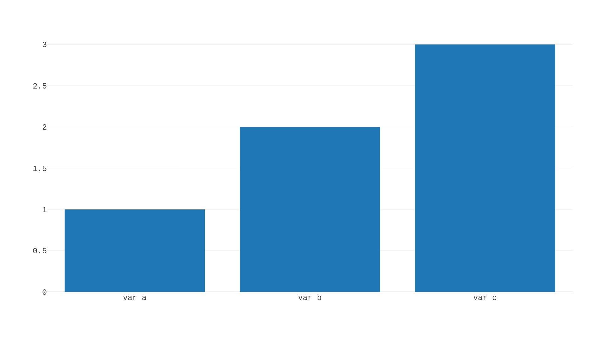
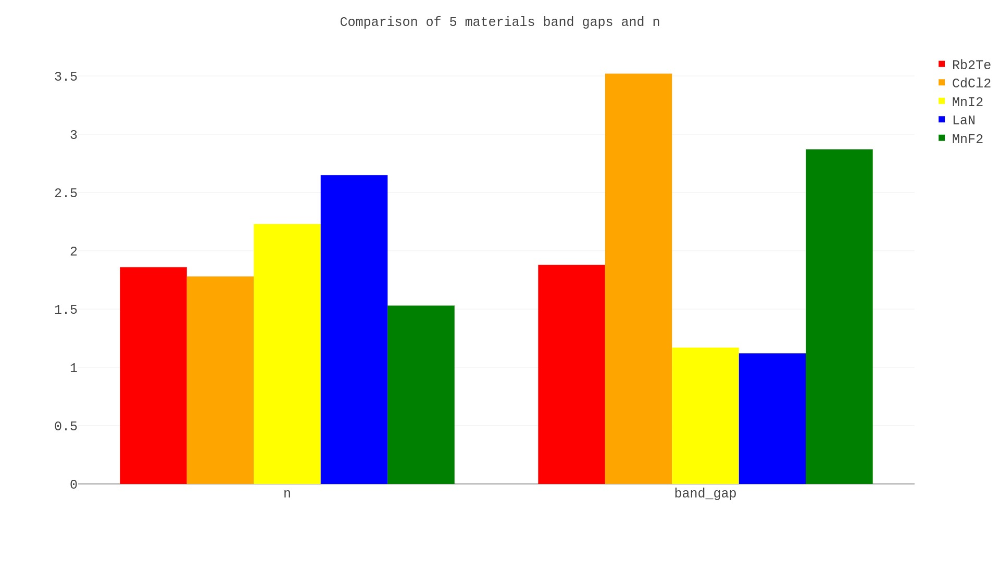
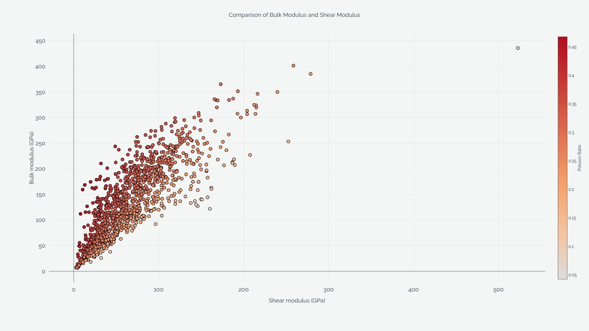
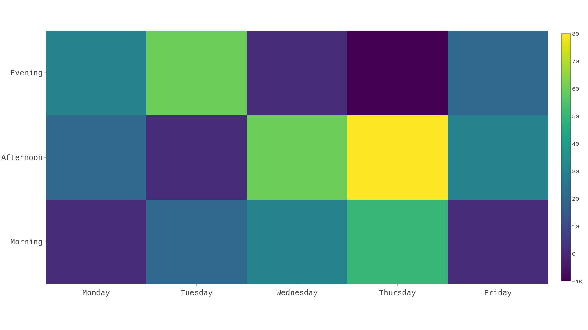
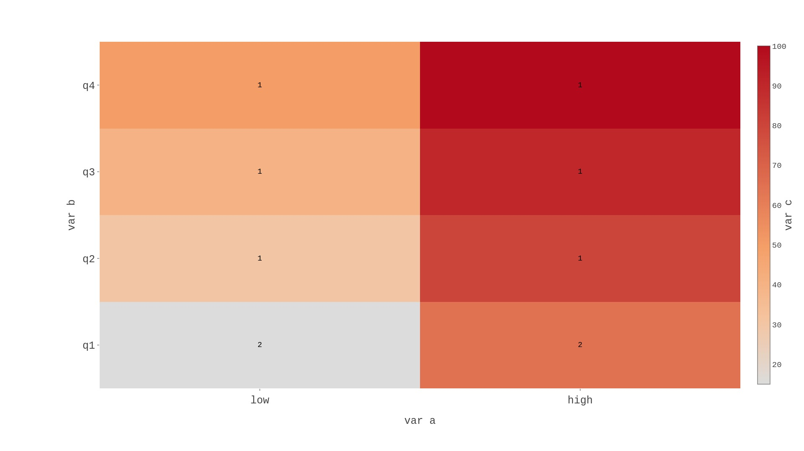
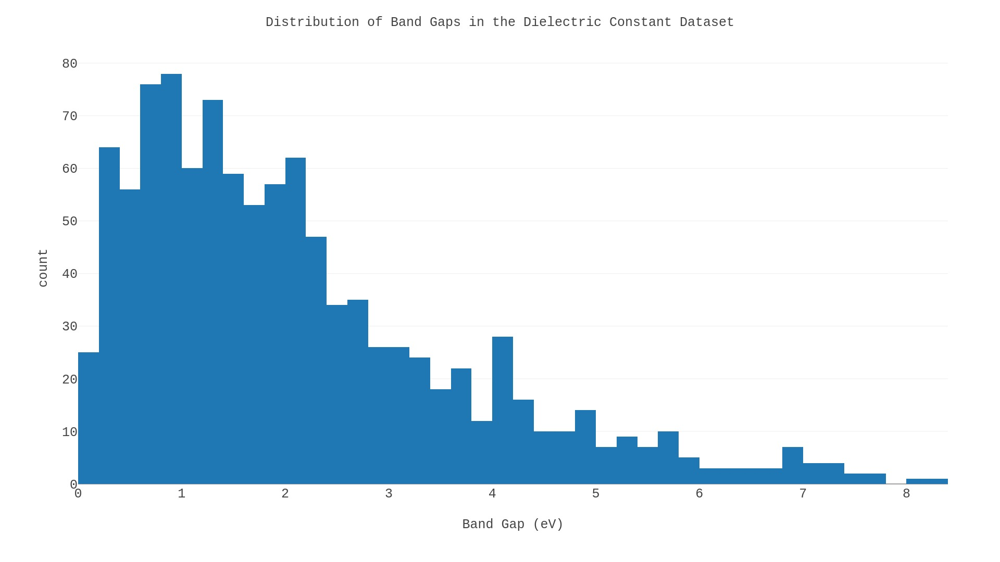
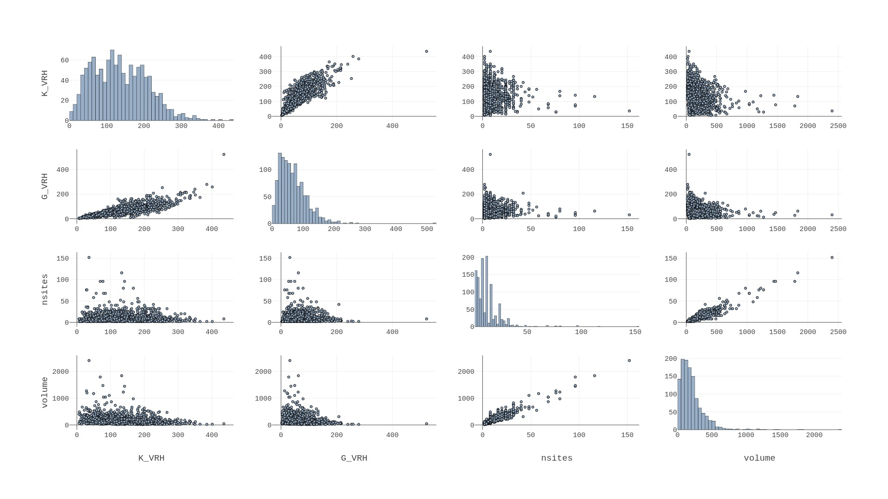
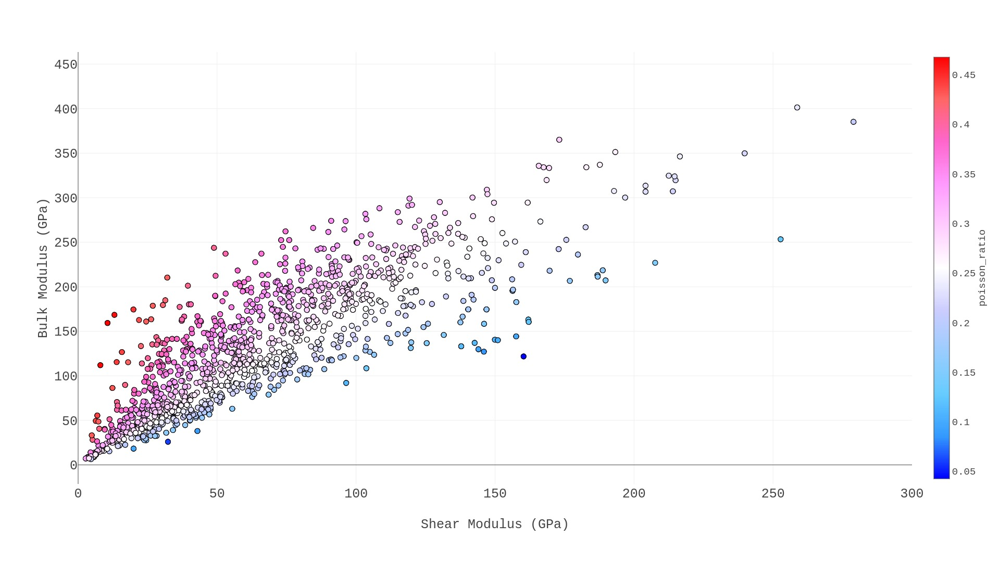

# Summary
In this file we show static outputs of the basic PlotlyFig examples, all 1000x1400 or 1080x1920 px. 
Running the examples should provide similar outputs in interactive form.

### bar.py

`basic_bar()`: `static_bar_basic.jpeg`

`advanced_bar()`: `static_bar_advanced.jpeg`

### extras.py

`plot_modes()`: No static images provided.

`formatting_example()`: `static_formatting_example.jpeg`

`static_formatting_latex.jpeg`

### heatmap.py

`plot_basic_heatmap()`: `static_heatmap_basic.jpeg`

`plot_simple_heatmap_df()`: `static_heatmap_df.jpeg`

### histogram.py
`basic_histogram()`: `static_histogram_basic.jpeg`

`advanced_histogram()`: `static_histogram_advanced.jpeg`

### parallel_coordinates.py
`basic_parallel_coordinates()`: `static_parallel_coords.jpeg`

### scatter_matrix.py

`plot_scatter_matrix()`: `static_scatter_simple.jpeg`

`static_scatter_complex.jpeg`

### violin.py

`simple_violin()`: `static_violin.png`

### xy.py
`plot_simple_xy()`: `static_xy_simple.jpeg`

`plot_shear_moduli()`: `static_xy_shear_moduli.jpeg`

`plot_thermoelectrics()`: `static_xy_thermoelectrics.jpeg`

`plot_expt_compt_band_gaps()`: `static_xy_band_gaps.jpeg`

`static_xy_band_gaps.jpeg`

